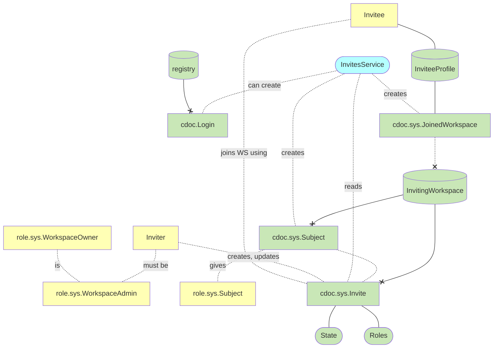
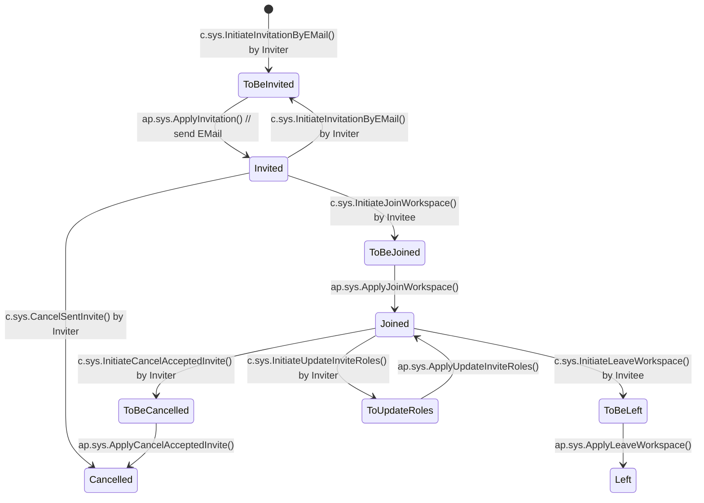
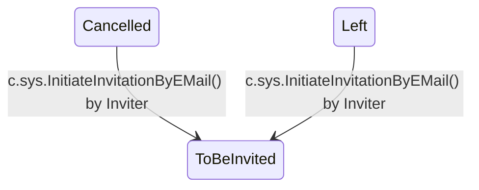
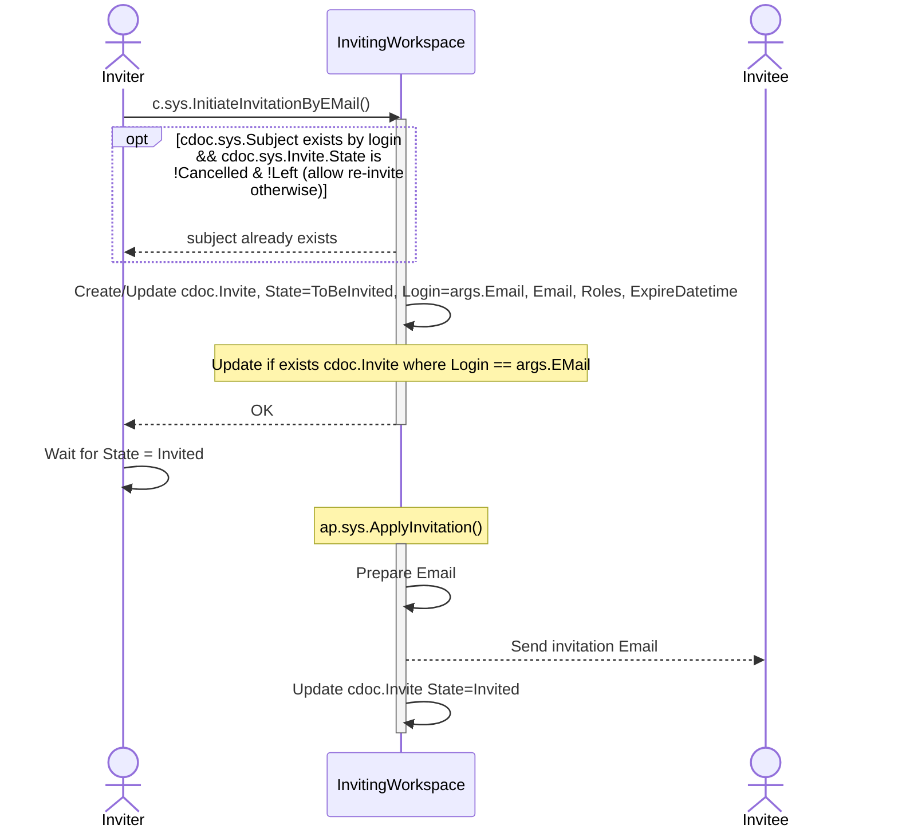
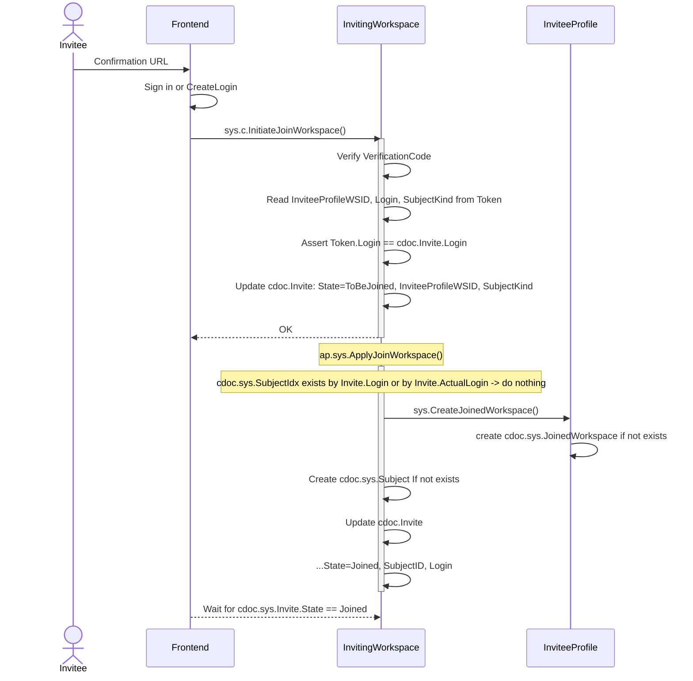
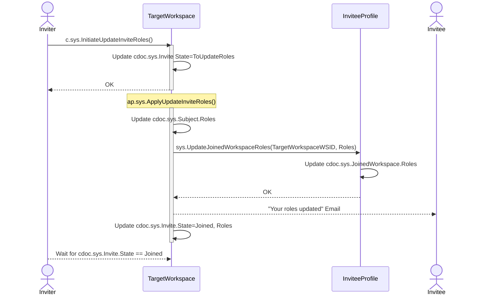
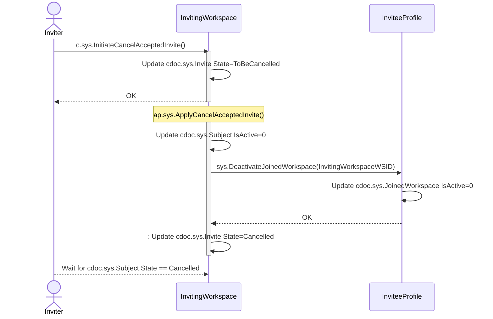
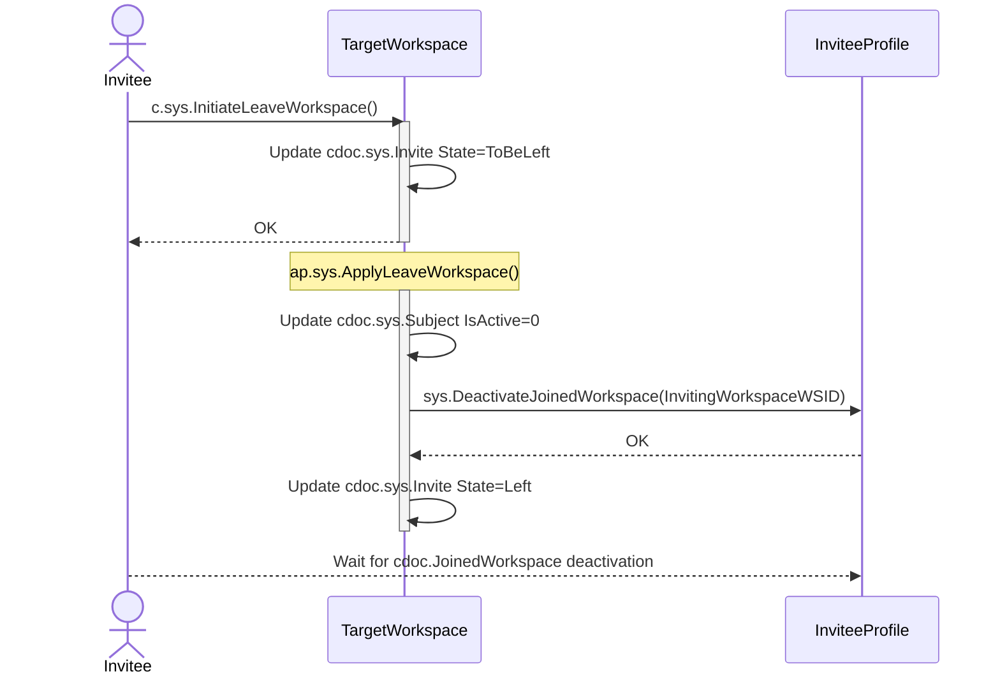
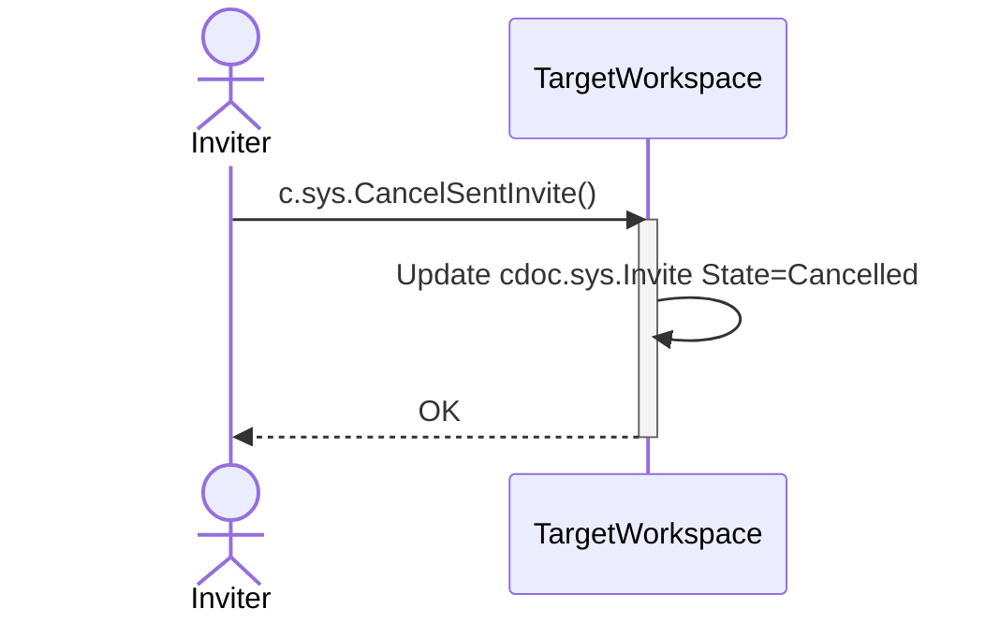

# Invites

Invite Users/Devices to Workspaces

## Overview

### Core Components

#### Roles and Permissions
- **WorkspaceOwner**: Highest level role, automatically has admin privileges
- **WorkspaceAdmin**: Can manage invites and user access

#### Key Documents
- **Invite**: Tracks invitation status and metadata
- **Subject**: Represents an invited user/device in the workspace
- **JoinedWorkspace**: Records workspace membership details
- **Login**: Manages user authentication and access

### Invitation Lifecycle

#### Core Commands

##### Invitation Management
- `InitiateInvitationByEmail`: Creates new invitation
  - Requires WorkspaceAdmin role
  - Includes email, roles, expiration, and email template
- `InitiateJoinWorkspace`: Processes invite acceptance
  - Requires verification code
  - Creates necessary workspace access records

##### Role Management
- `InitiateUpdateInviteRoles`: Updates member permissions
  - Available for joined members only
  - Includes email notification

##### Membership Termination
- `InitiateCancelAcceptedInvite`: Admin removes member
- `InitiateLeaveWorkspace`: Member voluntarily leaves
- `CancelSentInvite`: Cancels pending invitation

## Motivation

- [Air: Reseller Portal: Invite unTill Payments Users](625718)
- As a workspace owner I want to invite users into workspace with specified roles, so that if they accept it, they are granted to access my workspace\\
- As a workspace owner I want to change invited user's roles
- As a user, I want to see the list of my workspaces and roles, so that I know what am I available to work with
- As a user, I want to be able to leave the workspace I'm invited to
- As a workspace owner I want to ban user to he doesn't have access to my workspace anymore
- [Resellers Portal](https://github.com/untillpro/airs-design/blob/master/resellerportal/usersmgmt.md) 
- [invites.md](https://github.com/heeus/heeus-design/blob/d9b14d105ef443a2f70cc6fc8530ab42f36a6f5d/workspaces/invites.md)
- https://github.com/heeus/heeus-design/blob/main/workspaces/invites.md

## Contents

- [Concepts](#concepts)
- [Invite State Diagram](#invite-state-diagram)
  - [Main sequence](#main-sequence)
  - [Extra](#extra)

Commands
- [c.sys.InitiateInvitationByEMail()](#csysinitiateinvitationbyemail)
- [c.sys.InitiateJoinWorkspace()](#csysinitiatejoinworkspace)
- [c.sys.InitiateUpdateInviteRoles()](#csysinitiateupdateinviteroles)
- [c.sys.InitiateCancelAcceptedInvite()](#csysinitiatecancelacceptedinvite)
- [c.sys.InitiateLeaveWorkspace()](#csysinitiateleaveworkspace)
- [c.sys.CancelSentInvite()](#csyscancelsentinvite)

Docs
- [cdoc.sys.Invite](#cdocsysinvite)
- [cdoc.sys.Subject](#cdocsyssubject)

## Concepts

## Invite State Diagram

### Main sequence

### Extra

## c.sys.InitiateInvitationByEMail()

- AuthZ: role.sys.WorkspaceAdmin
- Params
    - Email
    - Roles
    - ExpireDatetime
    - EmailTemplate // Must be prefixed with 'text:' or 'resource:'
        - Placeholders:
            - ${VerificationCode}
            - ${InviteID}
            - ${WSID} - Inviting Workspace ID
            - ${WSName} - Inviting Workspace Name
            - ${Email} - Invitee Email
    - EmailSubject
- Errors
    - State not in (None, Cancelled, Left, Invited)
    - invalid argument EmailTemplate
- //TODO: EMail => Login must be implemented, currently it is supposed that EMail == Login

**Behavior:**

## cdoc.sys.Invite

- ID
- SubjectKind ([User/Device](https://github.com/heeus/core-istructs/blob/b95ff00ea97f3731f58b8d95f71914f29786e6bf/types.go#L81))
- Login // actually `c.sys.InitiateInvitationByEmail.EMail`
- Email // actually `c.sys.InitiateInvitationByEmail.EMail`
- Roles (comma-separated)
- ExpireDatetime (unix-timestamp)
- VerificationCode
- State
- Created (unix-timestamp) ???
- Updated (unix-timestamp) ???
- SubjectID (Subject.ID) // by ap.sys.ApplyJoinWorkspace
- InviteeProfileWSID     // by ap.sys.ApplyJoinWorkspace
- ActualLogin            // `token.Login`, by ap.sys.ApplyJoinWorkspace

## c.sys.InitiateJoinWorkspace()

- AuthZ: PrincipalToken + VerificationCode
- Params
  - InviteID
  - VerificationCode
- Errors
  - Invite state is not in (Invited)
  - Invite does not exist
  - Invite expired
  - token login does not match invite login
  - wrong Verification Code

**Behavior:**

## cdoc.sys.Subject

- Login // old stored records -> `Invite.Login` that is actually `c.sys.InitiateInvitationByEMail.Email`, new records (starting from https://github.com/voedger/voedger/issues/1107) - `Invite.ActualLogin` that is login from token
- SubjectKind ([User/Device](https://github.com/heeus/core-istructs/blob/b95ff00ea97f3731f58b8d95f71914f29786e6bf/types.go#L81))
- Roles (comma-separated list)

## c.sys.InitiateUpdateInviteRoles()

- AuthZ: role.sys.WorkspaceAdmin
- Params
    - InviteID
    - Roles
    - EmailTemplate // Must be prefixed with 'text:' or 'resource:'
    - EmailSubject
- Errors
    - State not in (Joined)
    - invalid argument EmailTemplate

**Behavior:**

## c.sys.InitiateCancelAcceptedInvite()

- AuthZ: role.sys.WorkspaceAdmin
- Params
    - InviteID
- Errors
    - State not in (Joined)

**Behavior:**

## c.sys.InitiateLeaveWorkspace()

- AuthZ: role.sys.Subject
- Params
    - Token.Login is used to find Invite
- Errors
    - Invite not found
    - State not in (Joined)

**Behavior:**

## c.sys.CancelSentInvite()

- AuthZ: role.sys.WorkspaceAdmin
- Params
    - InviteID
- Errors
    - State not in (Invited)

