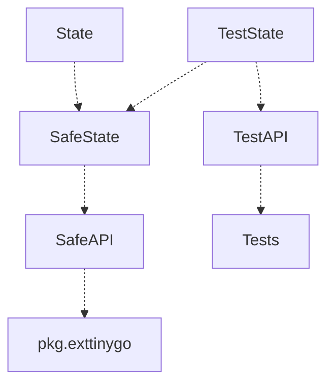
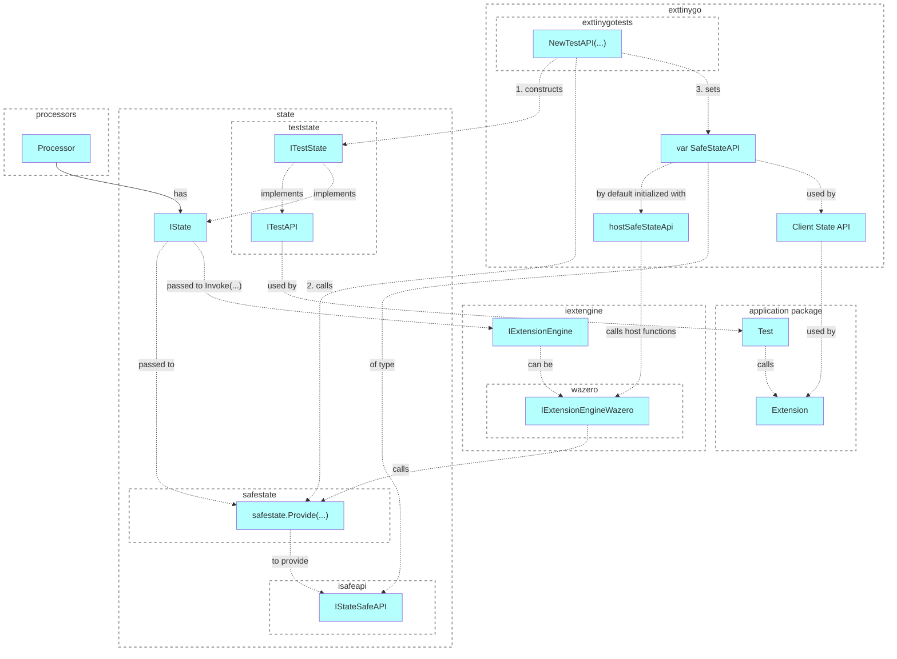

# API for testing

## Motivation

- https://github.com/voedger/voedger/issues/1647

## Context

- https://github.com/voedger/voedger/blob/937875623f4291dd33eece8787a817cd71ac7019/pkg/iextenginewazero/impl_test.go#L37

## Proposal

packages
- state
  - safestate
  - teststate

## Functional Design

- https://github.com/michael-say/voedger/blob/1647-wasm-state-low-level-api-for-testing/pkg/iextengine/wazero/_testdata/basicusage/main_test.go

## Technical Design

### Principles
- Use events to prepare context CUDs and IArgumentObject data
- Use IAppStructs to prepare View context
- IEvents.PutWlog to prepare WLog context
- SafeStateAPI is a low-level API for State which implements the following principles:
    - used by extension engines
    - automatically converts package paths (extensions work with full paths)
    - Keys, Values, Key- and Value-Builders are represented with numbers, to be transferred between Host and Extension environments.

### Design

## Issues

- https://github.com/voedger/voedger/issues/1647
